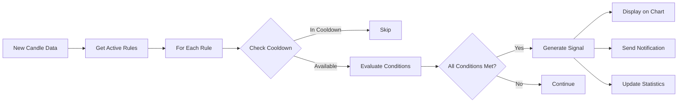

# 🔔 No-Code Alert Rule Builder - Hướng dẫn sử dụng

## 📋 Tổng quan

Hệ thống **No-Code Alert Rule Builder** cho phép người dùng tạo các quy tắc cảnh báo giao dịch một cách trực quan, không cần viết code. Người dùng có thể kết hợp các điều kiện về chỉ báo kỹ thuật (RSI, MACD, SMA...), mẫu nến (Hammer, Doji, Engulfing...), giá và khối lượng để tạo ra tín hiệu mua/bán tự động.

## 🎯 Tính năng chính

### 1. **Rule Builder UI (Frontend)**
- ✅ Giao diện kéo thả trực quan với modal dialog
- ✅ Hỗ trợ tạo điều kiện phức tạp với logic AND/OR
- ✅ So sánh giá trị tĩnh hoặc giữa các chỉ báo
- ✅ Quản lý danh sách quy tắc: Tạo, Sửa, Xóa, Tạm dừng
- ✅ Hiển thị Buy/Sell signals trực tiếp trên biểu đồ

### 2. **Rule Engine (Backend)**
- ✅ Đánh giá quy tắc real-time khi có dữ liệu nến mới
- ✅ Hỗ trợ nhiều loại điều kiện:
  - **INDICATOR**: RSI, MACD, SMA, EMA, Bollinger Bands
  - **PATTERN**: Hammer, Doji, Engulfing, Morning Star...
  - **PRICE**: Close, High, Low, Open
  - **VOLUME**: Khối lượng giao dịch
- ✅ Cross detection (CROSS_UP, CROSS_DOWN)
- ✅ Cooldown mechanism để tránh spam thông báo
- ✅ Statistics tracking cho mỗi quy tắc

## 📊 Schema Alert Rule

```javascript
{
  "_id": "rule_id",
  "userId": "user_123",
  "symbol": "HPG",
  "ruleName": "Bắt đáy HPG với Hammer",
  "description": "Mua khi xuất hiện nến Hammer và RSI < 30",
  "signalType": "BUY", // BUY | SELL | EXIT_BUY | EXIT_SELL
  "status": "ACTIVE",  // ACTIVE | PAUSED | DISABLED
  "priority": 0,       // Độ ưu tiên (càng cao càng ưu tiên)
  "timeframe": "1d",   // Khung thời gian áp dụng
  "logicOperator": "AND", // AND | OR
  
  "conditions": [
    {
      "type": "INDICATOR",
      "key": "rsi",
      "params": { "period": 14 },
      "operator": "<",
      "value": 30
    },
    {
      "type": "PATTERN",
      "key": "hammer",
      "operator": "IS_TRUE"
    }
  ],
  
  "action": {
    "type": "NOTIFY_WEB",
    "messageTemplate": "Tín hiệu MUA: {{symbol}} - {{ruleName}}",
    "cooldownMinutes": 5
  },
  
  "statistics": {
    "triggeredCount": 0,
    "successfulSignals": 0,
    "falseSignals": 0,
    "lastTriggeredAt": null
  },
  
  "createdAt": "2025-11-26T10:00:00Z",
  "updatedAt": "2025-11-26T10:00:00Z"
}
```

## 🚀 Cách sử dụng

### Bước 1: Mở Rule Builder
1. Trên biểu đồ StockChart, nhấn vào button **"🔔 Alert Rules"** ở góc trên bên phải
2. Click **"+ Tạo quy tắc"** để mở Rule Builder Modal

### Bước 2: Thiết lập thông tin cơ bản
- **Tên quy tắc**: Đặt tên dễ nhớ (VD: "Bắt đáy HPG với Hammer")
- **Mô tả**: Mô tả chi tiết quy tắc (tùy chọn)
- **Mã cổ phiếu**: Symbol áp dụng quy tắc (VD: "HPG")
- **Loại tín hiệu**: 
  - `BUY` - Tín hiệu mua
  - `SELL` - Tín hiệu bán
  - `EXIT_BUY` - Thoát lệnh Long
  - `EXIT_SELL` - Thoát lệnh Short
- **Trạng thái**: ACTIVE (mặc định)
- **Độ ưu tiên**: 0-100 (mặc định: 0)

### Bước 3: Tạo điều kiện

#### Loại điều kiện:
1. **Chỉ báo kỹ thuật (INDICATOR)**:
   - RSI, SMA, EMA, MACD, Bollinger Bands
   - Cần thiết lập: Period (chu kỳ)
   
2. **Mẫu nến (PATTERN)**:
   - Single: Hammer, Doji, Shooting Star...
   - Double: Engulfing, Harami, Piercing Line...
   - Triple: Morning Star, Evening Star, Three White Soldiers...
   
3. **Giá (PRICE)**:
   - Close, High, Low, Open
   
4. **Khối lượng (VOLUME)**:
   - So sánh với giá trị tĩnh hoặc average volume

#### Toán tử:
- **So sánh số**: `<`, `>`, `<=`, `>=`, `==`, `!=`
- **Cross detection**: `CROSS_UP`, `CROSS_DOWN` (cho chỉ báo)
- **Pattern**: `IS_TRUE`, `IS_FALSE`

#### Logic kết hợp:
- **AND**: Tất cả điều kiện phải đúng
- **OR**: Ít nhất một điều kiện đúng

### Bước 4: Thiết lập hành động
- **Loại thông báo**: NOTIFY_WEB (Web notification)
- **Nội dung**: Sử dụng template variables:
  - `{{symbol}}` - Mã cổ phiếu
  - `{{signalType}}` - Loại tín hiệu
  - `{{ruleName}}` - Tên quy tắc
- **Cooldown**: Thời gian chờ giữa các lần thông báo (phút)

### Bước 5: Lưu và quản lý
- Click **"Tạo quy tắc"** để lưu
- Quy tắc sẽ tự động đánh giá khi có dữ liệu nến mới
- Tín hiệu Buy/Sell sẽ hiển thị trên biểu đồ

## 📝 Ví dụ quy tắc

### Ví dụ 1: Bắt đáy với RSI và Hammer
```javascript
{
  "ruleName": "Bắt đáy HPG",
  "symbol": "HPG",
  "signalType": "BUY",
  "logicOperator": "AND",
  "conditions": [
    {
      "type": "INDICATOR",
      "key": "rsi",
      "params": { "period": 14 },
      "operator": "<",
      "value": 30
    },
    {
      "type": "PATTERN",
      "key": "hammer",
      "operator": "IS_TRUE"
    }
  ]
}
```

### Ví dụ 2: Golden Cross (Giá cắt lên MA20)
```javascript
{
  "ruleName": "Golden Cross",
  "symbol": "VNM",
  "signalType": "BUY",
  "logicOperator": "AND",
  "conditions": [
    {
      "type": "PRICE",
      "key": "close",
      "operator": "CROSS_UP",
      "compareWith": {
        "type": "INDICATOR",
        "key": "sma",
        "params": { "period": 20 }
      }
    }
  ]
}
```

### Ví dụ 3: Bán khi RSI quá mua
```javascript
{
  "ruleName": "Chốt lời RSI > 70",
  "symbol": "FPT",
  "signalType": "SELL",
  "logicOperator": "AND",
  "conditions": [
    {
      "type": "INDICATOR",
      "key": "rsi",
      "params": { "period": 14 },
      "operator": ">",
      "value": 70
    },
    {
      "type": "PATTERN",
      "key": "shooting_star",
      "operator": "IS_TRUE"
    }
  ]
}
```

## 🔧 API Endpoints

### CRUD Operations
```
POST   /api/alert-rules           - Tạo quy tắc mới
GET    /api/alert-rules           - Lấy tất cả quy tắc của user
GET    /api/alert-rules/:id       - Lấy một quy tắc
PUT    /api/alert-rules/:id       - Cập nhật quy tắc
DELETE /api/alert-rules/:id       - Xóa quy tắc
GET    /api/alert-rules/symbol/:symbol - Lấy quy tắc theo symbol
PATCH  /api/alert-rules/:id/toggle     - Toggle status (ACTIVE/PAUSED)
```

## 🎨 Component Structure

```
Frontend:
├── components/
│   ├── AlertRuleModal.jsx       # Modal tạo/sửa quy tắc
│   ├── AlertRuleModal.css
│   ├── AlertRuleManager.jsx     # Quản lý danh sách quy tắc
│   ├── AlertRuleManager.css
│   └── StockChart.jsx           # Tích hợp hiển thị signals
├── constants/
│   └── alertRuleOptions.js      # Cấu hình dropdown options
└── services/
    └── alertRuleApi.js          # API client

Backend:
├── domain/
│   └── AlertRule.java           # Entity
├── repository/
│   └── AlertRuleRepository.java
├── service/
│   ├── AlertRuleService.java           # CRUD operations
│   ├── RuleEngineService.java          # Rule evaluation
│   ├── TechnicalIndicatorService.java  # Indicator calculations
│   └── PatternDetectionService.java    # Pattern detection
├── controller/
│   └── AlertRuleController.java
└── dto/
    ├── AlertRuleRequest.java
    ├── AlertRuleResponse.java
    └── AlertSignal.java
```

## 🔍 Rule Evaluation Flow



## 🛠️ Technical Stack

**Frontend:**
- React 18
- Lightweight Charts
- CSS3 với animations
- Axios cho API calls

**Backend:**
- Spring Boot 3.3.5
- MongoDB
- Java 17
- Lombok

## 📚 Best Practices

1. **Đặt tên quy tắc rõ ràng**: Sử dụng tên mô tả chiến lược (VD: "Bắt đáy RSI < 30")
2. **Sử dụng cooldown hợp lý**: 5-15 phút để tránh spam
3. **Test quy tắc trước**: Tạo với status PAUSED để kiểm tra
4. **Kết hợp nhiều điều kiện**: Dùng AND để tăng độ chính xác
5. **Theo dõi statistics**: Xem triggeredCount để đánh giá hiệu quả

## 🐛 Troubleshooting

**Quy tắc không kích hoạt:**
- Kiểm tra status = ACTIVE
- Xác nhận symbol đúng
- Kiểm tra điều kiện có hợp lý không
- Xem cooldown đã hết chưa

**Signal không hiển thị trên chart:**
- Refresh lại trang
- Kiểm tra candleIndex có hợp lệ không
- Xem console log để debug

## 📞 Support

Nếu gặp vấn đề, vui lòng liên hệ:
- Email: support@chungkhoannt.com
- GitHub Issues: [Link]

---

**Version**: 1.0.0  
**Last Updated**: 26/11/2025  
**Author**: Senior Fintech Developer Team
